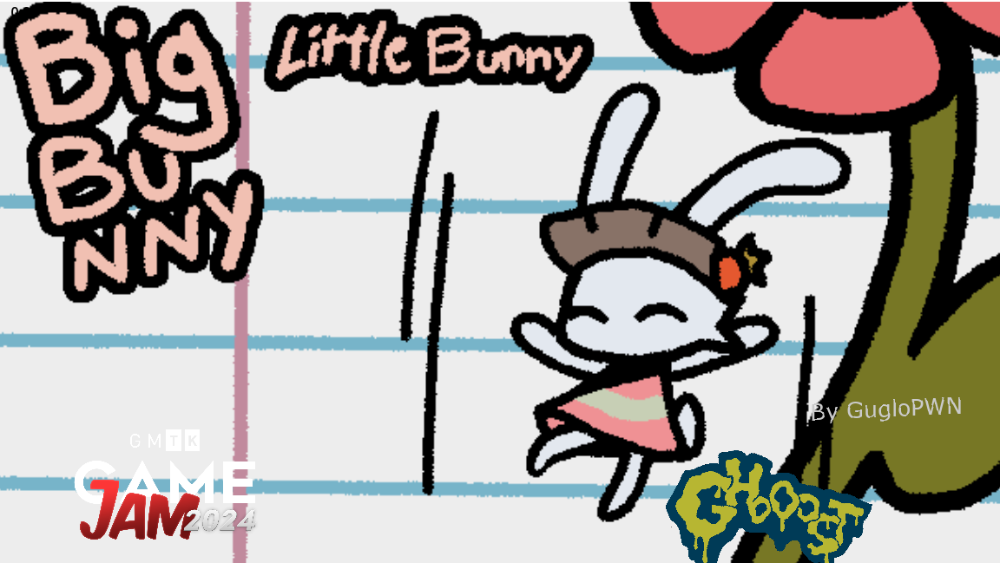
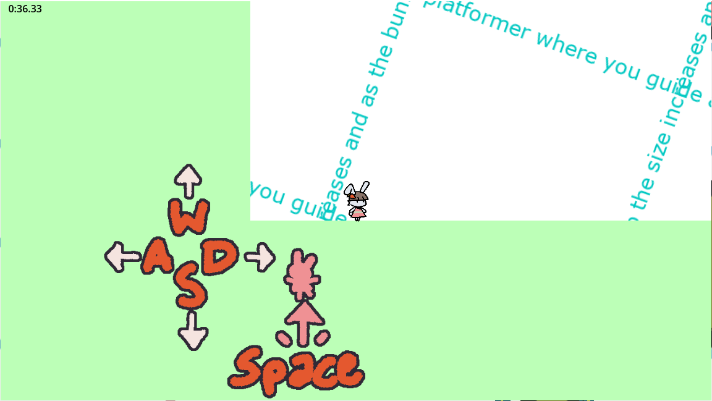
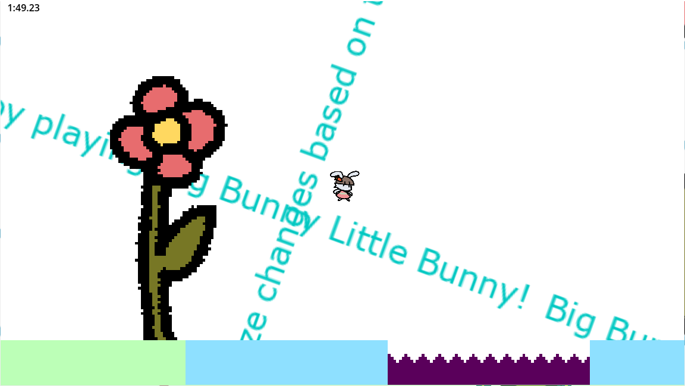
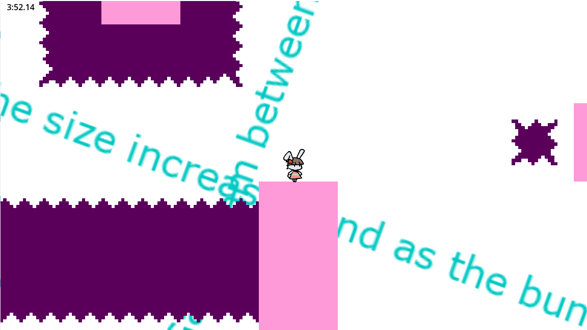
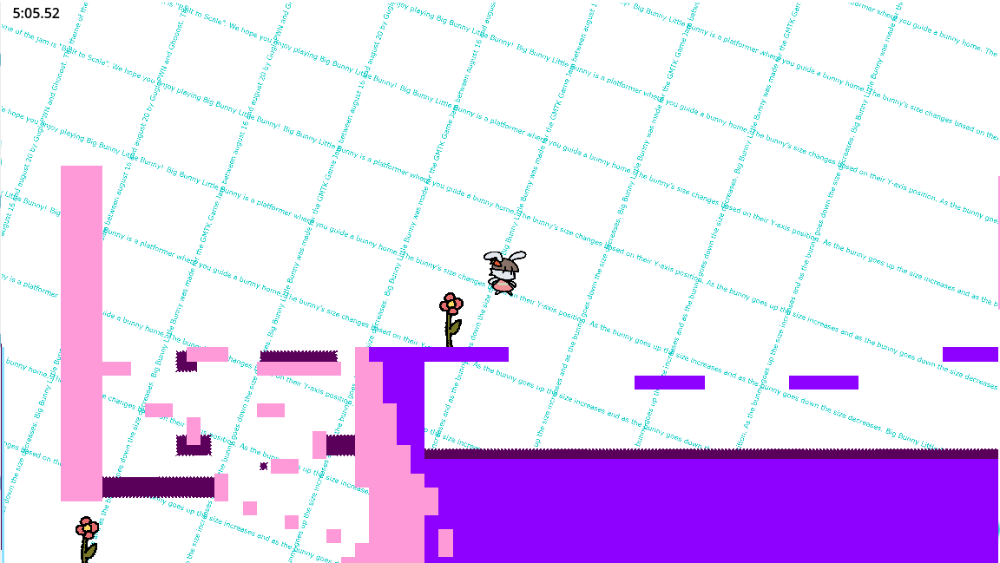
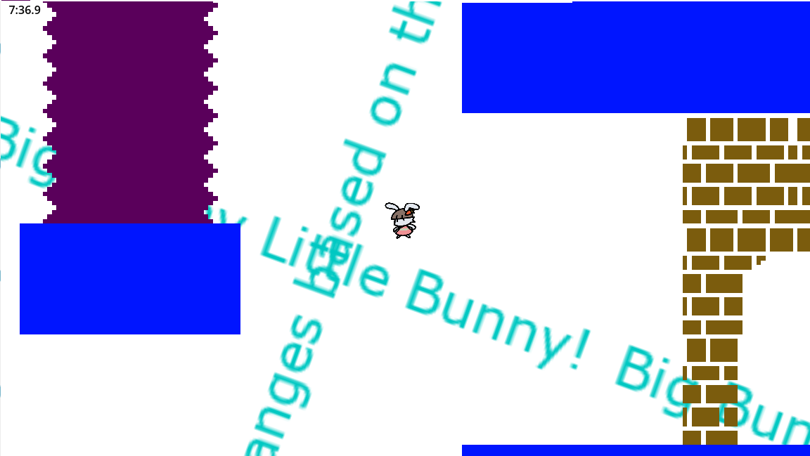

# Big Bunny Little Bunny

- Overview
- Media
- Further Work

## Overview

Big Bunny Little Bunny is a game created for the GMTK Game Jam 2024. It was coded in Godot by GugloPWN with art by Ghooost. The game jam was 96 hours long but further additions and improvements are planned. The game is a platformer where you jump and avoid spikes while trying to get to the end. The main gameplay gimmick is that the player character and physics scale with the players Y poisition. As the player moves upward the player gets larger and as they move downward they get smaller.

## Media

## Further work

Here is a list of future work to improve the game:

- Add coyote time to jumps
- Add movement code to _physics_process()
- Make the initial “trick” jump higher up so it's more obvious
- New graphic to replace my weird castle 
- Move secret shame bunny further away from play area
- Make camera zoom based on y-axis for the player sprite
- Add some momentum to the x-axis (only a little!)
- Tweak level layout of that trick jump at the start to be more obvious 
- Add shaders + particle effects?
- Start screen 
	- Move starting screen away from play space 
	- Make elements separate and animate them
	- Add “Press Space to play”
	- New graphic for Guglopwn 
	- Make GMTK logo stand out better
- End screen 
	- Move ending screen away from play space
	- Make elements separate and animate them 
	- Make speedrun timer bigger and add text description 
	- Add sunflower song when you finish in under 2 minutes 
	- Fix transition from end screen back to gameplay 

